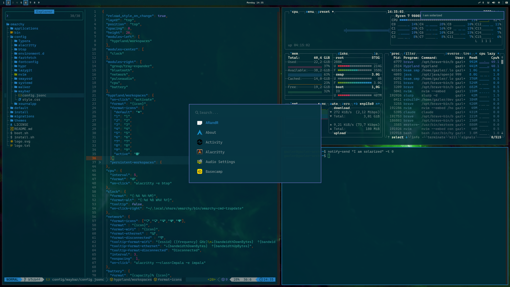

# Omarchy Selenized

Selenized Dark theme for [Omarchy](https://omarchy.org) 4.0 (Quattro), based on
Jan Warchoł's [Selenized](https://github.com/jan-warchol/selenized) palette — a
redesign of Solarized with higher contrast and a fine-tuned set of colors.

Every application config (Alacritty, foot, Kitty, Ghostty, Hyprland borders,
btop, the Omarchy shell, Neovim, VS Code, …) is generated by Omarchy from
`colors.toml`, the Quattro semantic palette. `neovim.lua` pins
[`maxmx03/solarized.nvim`](https://github.com/maxmx03/solarized.nvim) with its
`selenized` palette; `vscode.json` pins the
[Selenized Themes](https://marketplace.visualstudio.com/items?itemName=dieghernan.selenized-theme)
extension.



## Install

```bash
omarchy theme install https://github.com/ziegs/omarchy-selenized-theme
omarchy theme set selenized
```

To develop it in place, clone the repo somewhere and symlink it into Omarchy's
theme directory so every file (including `neovim.lua` / `vscode.json`) is
honored:

```bash
git clone git@github.com:ziegs/omarchy-selenized-theme.git ~/omarchy-selenized-theme
ln -s ~/omarchy-selenized-theme ~/.config/omarchy/themes/selenized
omarchy theme set selenized
```
